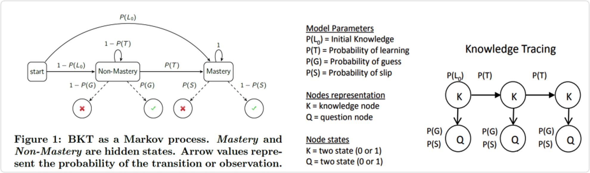
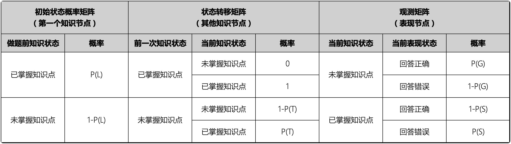

# 贝叶斯知识点追踪模型

## BKT模型业务应用待解决问题

| 待解决问题                                                   | 解决方案                                                     | 状态                                                         |
| ------------------------------------------------------------ | ------------------------------------------------------------ | ------------------------------------------------------------ |
| BKT模型最终是根据贝叶斯公式在不同$obs_t$下的后验概率值，并未对知识点掌握与否给出直接的结果，而实际业务最终需要的是学生在某个末级知识点是否掌握。 | 根据知识点下不同题目的作答成绩、求解后验概率有没有满足seed(默认≥0.85)的条件，然后返回用户ID，末级知识点ID，末级知识点掌握状态分类（0 \| 1），掌握值 | <span style="white-space:nowrap;">[已解决](#ng_state)&emsp;&emsp;</span> |
| BKT模型是根据历史答题数据拟合出学习参数和表现参数，但如果末级知识点在拟合时所有的学生都为学过、则不会得出相关参数、也就意味着模型对未来新学习数据鲁棒性极差。 | 在对知识点预测时，若知识点在模型拟合得到的参数中不存在：<br>1、返回不预测的结果<br/>2、对新知识点进行拟合，并进行预测，但这种状况下因为新知识点观测值较少、结果不一定理想。 | 待解决                                                       |
| 现实业务中V3版本42讲之后的实际答题数据有5000W+的数据量，模型在首次拟合时将极大地耗费算力和时间。 | 1、目前已拟合21年3月的答题数据，AUC0.61，还需要把剩余的数据进行拟合。<br> | 待解决                                                       |

<br>

<br>

## BKT模型简介

>   贝叶斯知识点追踪模型（BKT）是知识追踪最常用的一个模型，是含有隐变量的马尔可夫模型（HMM），BKT通过对学生的每个知识点单独建模来了解学生特定知识点的掌握情况（模型无法表示知识点间的相关性）。
>
>   它假设每个知识点由猜测率、学习率、失误率和学习知识之前的先验概率4个参数组成，目前已经发展成为智能辅导系统中对学习者知识掌握情况建模的主流方法。



如左上图，BKT是一个马尔可夫过程，自身含有知识点掌握和不掌握的隐藏状态。通过当下答题的表现状态，重新计算P(T)值并传递给下一个知识点。其中可见节点表示学生对于已知的二值问题答题结果序列obst，而隐藏节点表示学生的潜在知识状态。BKT从历史学生答题数据中拟合得到学习参数（learn）、猜测参数（guess）和失误参数（slip），参数定义如下：
$$
prior = P(L_{0})
$$

$$
learn = P(T) = P(L_{t+1} = 1|L_t=0)
$$

$$
guess = P(G) = P(obs_t = 1|L_t=0)
$$

$$
slip = P(S) = P(obs_t = 0|L_t=1)
$$

$P(L_{0})$虽然表示先验概率，但BKT模型同时$P(L_t)$定义为学生在不同时间下的掌握概率。之后会根据新的答题数据掌握与否重新并更新$P(L_t)$，也可以称之为更新$P(L_t)$的后验概率，计算如下：
$$
P(L_t|obs_t = 1) = \frac{P(L_t)(1-P(S))}{P(L_t)(1-P(S))  +  (1-P(L_t))P(G)}
$$

$$
P(L_t|obs_t = 0) = \frac{P(L_t)P(S)}{P(L_t)P(S)  +  (1-P(L_t))(1-P(G))}
$$

更新后的先验不包括从即时反馈和任何其他教学支持中吸取学习的可能性，定义如下：
$$
P(L_{t+1}) = P(L_t|obs_t) + (1-P(L_t|obs_t))P(T)
$$


在标准的BKT模型中是假设学习过后不存在遗忘的情况，定义如下：
$$
P(F) = P(L_{t+1}=0|L_t=1)=0
$$


每一个节点都通过条件概率表（下图）来量化父节点对自身的影响。



<br>

BKT同时支持对不同的的知识点单独进行建模的，理论上来说，训练数据有多少个知识点，就有多少组对应的（L0,T,G,S）参数。

| 学习参数     | 初始概率P(L0) = Intirial Knowledge，表示学生的未开始做这道题目时或开始连续这项知识点的时候，掌握概率 |
| ------------ | ------------------------------------------------------------ |
| **学习参数** | **学习概率P(T) = Probability of learning，表示学生经过做题练习后，知识点从不会到学会的概率** |
| **表现参数** | **猜测概率P(G) = Probability of guess，表示学生没掌握这项知识点，但是还是蒙对的概率** |
| **表现参数** | **失误概率P(S) = Probability of slip，表示学生实际上掌握了这项知识点，但是还是给做错了的概率** |
| **遗忘参数** | **遗忘概率P(F) = Probability of forgets，表示学生对这项知识点，从会做到遗忘的概率** |

如上，每次学生答题后模型都会根据答题正误的序列利用贝叶斯公式迭代更新其对知识的掌握情况。当P（G）和P（S）都为0时，说明学习者答题不存在猜测和失误情况，答题结果将会客观真实地反映学习者的知识水平；如果P（G）和P（S）值大于0.5，说明知识追踪模型出现模型退化现象，学习者回答问题的结果不能用来反映其真实知识水平。

<br>

<br>

## BKT模型应用

示例数据

Row：答题时间序列号

Anon Student Id：学生ID

Problem Name：知识点下题目

正确的第一次尝试：题目下第一次答题结果，0错误，1正确

KC(Default)：知识点

| Row   | Anon Student Id | Problem Name | Correct First Attempt | KC(Default)         |
| ----- | --------------- | ------------ | --------------------- | ------------------- |
| 1927  | 745Yh           | RATIO2-001   | 1                     | Calculate unit rate |
| 1931  | 745Yh           | RATIO2-001   | 0                     | Calculate unit rate |
| 1947  | 745Yh           | RATIO2-012   | 0                     | Calculate unit rate |
| 1948  | 745Yh           | RATIO2-012   | 1                     | Calculate unit rate |
| 1963  | 745Yh           | RATIO2-054   | 0                     | Calculate unit rate |
| 1966  | 745Yh           | RATIO2-054   | 1                     | Calculate unit rate |
| 1978  | 745Yh           | RATIO2-029   | 1                     | Calculate unit rate |
| 1981  | 745Yh           | RATIO2-029   | 1                     | Calculate unit rate |
| 1997  | 745Yh           | RATIO2-109   | 1                     | Calculate unit rate |
| 1998  | 745Yh           | RATIO2-109   | 1                     | Calculate unit rate |
| 5289  | 3cjD21W         | RATIO2-001   | 1                     | Calculate unit rate |
| 5300  | 3cjD21W         | RATIO2-001   | 0                     | Calculate unit rate |
| 5312  | 3cjD21W         | RATIO2-071   | 0                     | Calculate unit rate |
| 5318  | 3cjD21W         | RATIO2-071   | 0                     | Calculate unit rate |
| 5332  | 3cjD21W         | RATIO2-099   | 0                     | Calculate unit rate |
| 5335  | 3cjD21W         | RATIO2-099   | 0                     | Calculate unit rate |
| 5351  | 3cjD21W         | RATIO2-177   | 1                     | Calculate unit rate |
| 5352  | 3cjD21W         | RATIO2-177   | 1                     | Calculate unit rate |
| 5366  | 3cjD21W         | RATIO2-078   | 1                     | Calculate unit rate |
| 5369  | 3cjD21W         | RATIO2-078   | 1                     | Calculate unit rate |
| 12464 | 4gJnw14         | RATIO2-001   | 1                     | Calculate unit rate |
| 12471 | 4gJnw14         | RATIO2-001   | 0                     | Calculate unit rate |
| 12482 | 4gJnw14         | RATIO2-127   | 0                     | Calculate unit rate |
| 12488 | 4gJnw14         | RATIO2-127   | 0                     | Calculate unit rate |
| 12500 | 4gJnw14         | RATIO2-140   | 1                     | Calculate unit rate |
| 12503 | 4gJnw14         | RATIO2-140   | 1                     | Calculate unit rate |
| 12522 | 4gJnw14         | RATIO2-061   | 0                     | Calculate unit rate |
| 12523 | 4gJnw14         | RATIO2-061   | 0                     | Calculate unit rate |
| 12539 | 4gJnw14         | RATIO2-106   | 0                     | Calculate unit rate |
| 12541 | 4gJnw14         | RATIO2-106   | 0                     | Calculate unit rate |
| 12557 | 4gJnw14         | RATIO2-022   | 0                     | Calculate unit rate |
| 12559 | 4gJnw14         | RATIO2-022   | 0                     | Calculate unit rate |
| 12575 | 4gJnw14         | RATIO2-180   | 0                     | Calculate unit rate |
| 12577 | 4gJnw14         | RATIO2-180   | 0                     | Calculate unit rate |
| 12593 | 4gJnw14         | RATIO2-149   | 1                     | Calculate unit rate |
| 12594 | 4gJnw14         | RATIO2-149   | 1                     | Calculate unit rate |
| 12610 | 4gJnw14         | RATIO2-003   | 1                     | Calculate unit rate |
| 12611 | 4gJnw14         | RATIO2-003   | 0                     | Calculate unit rate |
| 12623 | 4gJnw14         | RATIO2-156   | 0                     | Calculate unit rate |
| 12629 | 4gJnw14         | RATIO2-156   | 0                     | Calculate unit rate |
| 12645 | 4gJnw14         | RATIO2-071   | 0                     | Calculate unit rate |
| 12647 | 4gJnw14         | RATIO2-071   | 0                     | Calculate unit rate |
| 12663 | 4gJnw14         | RATIO2-062   | 1                     | Calculate unit rate |
| 12665 | 4gJnw14         | RATIO2-062   | 0                     | Calculate unit rate |
| 12681 | 4gJnw14         | RATIO2-131   | 0                     | Calculate unit rate |
| 12683 | 4gJnw14         | RATIO2-131   | 0                     | Calculate unit rate |
| 12699 | 4gJnw14         | RATIO2-144   | 1                     | Calculate unit rate |
| 12700 | 4gJnw14         | RATIO2-144   | 1                     | Calculate unit rate |
| 12716 | 4gJnw14         | RATIO2-130   | 1                     | Calculate unit rate |
| 12718 | 4gJnw14         | RATIO2-130   | 0                     | Calculate unit rate |

<br>

<br>

### BKT标准模型

*标准模型下也可以对不同的学生创建模型参数*

#### Step1 构建模型

```python
model = Model(num_fits=2)
model.coef_ = {'Calculate unit rate': {'prior': 0.5}}
```

num_fits：采用交叉验证的次数，此处采用2次

prior：初始概率$P(L_0)$

<br>

#### Step2 拟合模型

```python
model.fit(data=ct_df)
```

<br>

**拟合过程概况分析**

##### 1、根据skill(不同的知识点)循环计算

###### 1.1 model定义的num_fits循环请求初始化参数

根据拟合模型传入的:

num_learns(数据集中的resource_names)，默认为1

num_gs(数据集中的gs_names)，默认为1

trans_prior（根据数据集中的resource_names数据量将默认值array([[[20,1], [4,20]]])进行横纵向扩展）
given_notknow_prior，默认为array([[5.0], [0.5]])

given_know_prior，默认为array([[0.5], [5.0]])

pi_0_prior，默认为array([[100], [1]])

之后将trans_prior、given_notknow_prior、given_know_prior、pi_0_prior进行gamma计算，given_notknow_priorgamma计算后纵向添加num_gs维。

>   **Gamma分布即为多个独立且相同分布（iid）的指数分布变量的和的分布。**
>
>   伽玛分布 = 指数分布＊泊松分布
>
>   反映到模型当中就是当拟合函数传入的数据集根据泊松分布计算过程求解满足gamma值所需要的做题数量。

```python
# num_fits=0
# 根据拟合传入的参数，gama计算后得到的初始化学习参数和表现参数
# As参数表示做题时学生对题目答案的知道与不知道的概率情况
{'prior': 0.07139010598653306,
 'learns': array([0.29274635]),
 'forgets': array([0.]),
 'guesses': array([0.12393248]),
 'slips': array([0.07105116]),
 'As': array([[[1.        , 0.        ],[0.29274635, 0.70725365]]]),
 'emissions': array([[[9.99978873e-01, 2.11273858e-05],[1.83009641e-01, 8.16990359e-01]]]),
 'pi_0': array([[0.99606767],[0.00393233]])
}

# 拟合前若定义初始概率则修正初始化概率
{'prior': 0.5,
 'learns': array([0.29274635]),
 'forgets': array([0.]),
 'guesses': array([0.12393248]),
 'slips': array([0.07105116]),
 'As': array([[[1.        , 0.        ],[0.29274635, 0.70725365]]]),
 'emissions': array([[[9.99978873e-01, 2.11273858e-05],[1.83009641e-01, 8.16990359e-01]]]),
 'pi_0': array([[0.99606767],[0.00393233]])
}
```

###### 1.2 得到初始化初始化参数后根据EM算法对隐马尔科夫模型进行计算并更新概率值

>   EM算法：
>
>   最大似然估计根本目的是根据抽样的到的样本，反推出最有可能的分布参数（即模型）。然而，如果已知的数据中含有某些无法观测的隐藏变量时（例如知识点掌握与否对应的是题目作答，而题目作答又是多分类数据），直接使用最大似然估计是不足以解决问题的，这个时候就要依靠[EM(期望最大化)算法](https://blog.csdn.net/guoziqing506/article/details/81274276)。简单的说，EM算法是在依赖于无法观测的隐藏变量的概率模型中，寻找参数最大似然估计或者最大后验估计的算法。
>
>   1. 最大似然估计
>
>       假设我们手里现在有一个样本，这个样本服从某种分布，而分布有参数，可如果我现在不知道这个样本分布的具体参数是多少，我们就想要通过抽样得到的样本进行分析，从而估计出一个较准确的相关参数。以上，这种通过抽样结果反推分布参数的方法就是“最大似然估计”。
>
>   2. 隐藏变量
>
>       最大似然估计仅适用于不存在隐藏变量的概率模型。什么是隐藏变量？属于多个类别的样本混在一起，不同类别样本的参数不同，现在的任务是从总体中抽样，再通过抽样数据估计每个类别的分布参数。这个描述就是所谓的“在依赖于无法观测的隐藏变量的概率模型中，寻找参数最大似然估计”，隐藏变量在此处就是样本的类别，这个时候EM算法就派上用场了。
>
>   3. EM算法思想
>
>       直观考虑这种隐藏变量的问题，会使得人们陷入了一种两难的境地：我只有知道了哪些样本是属于同一个类别的，才能根据最大似然函数估计这个类别样本的分布参数；同样，我只有知道了不同类别样本的分布参数，才有可能判断现某个样本到底属于哪个类别的可能性更大。
>
>       也就是说，你不确定，我就确定不了；而我不确定，你也确定不了。此时我们可以先让其中一方随便确定一个值，然后用根据这个值看看对方如何变化，再根据对方的变化调整己方，这样你根据我调整，我再根据你调整，循环往复，最终双方都达到了收敛，也就是调整值几乎不变，那就可以确定相关的值了。
>
>       EM的求解思路
>
>       （1）我们先根据经验为每个类别（即隐藏变量）赋予一个初始分布，这相当于是假定了分布参数。然后根据分布的参数可以求取每个数据元组的隐藏变量的期望（相当于实施了归类操作）；
>
>       （2）再根据归类结果计算分布参数（向量）的最大似然值，然后根据这个最大似然值在反过来重新计算每个元组的隐藏变量的期望。
>
>       这样循环反复迭代，直到收敛（最终如果隐藏变量的期望与参数的最大似然值趋于稳定了），EM算法就算是执行完毕了。
>
>       
>
>   综上，EM算法由两步组成，第一步是E步，就是求期望；第二步是M步，就是最大化：
>
>   E步(Expectation)：根据当前的参数值，计算样本隐藏变量的期望；
>   M步(Maximum)：根据当前样本的隐藏变量，求解参数的最大似然估计；
>
>   [1] https://zhuanlan.zhihu.com/p/28298205
>
>   [2] https://zhuanlan.zhihu.com/p/28298944

```python
# 将修正后的初始化概率和数据代入EM算法
# 根据EM的求解思路（默认循环100次，收敛值为0.001），迭代求解最大似然估计值(迭代计算收敛值越接近于0.001的)
# num_fits=0求解的最大似然估计模型参数值
{'prior': 0.48619389261838664,
 'learns': array([0.0026586]), 
 'forgets': array([0.]), 
 'guesses': array([0.20748567]), 
 'slips': array([0.60860979]), 
 'As': array([[[0.9973414, 0.       ],[0.0026586, 1.       ]]]), 
 'emissions': array([[[0.79251433, 0.20748567],[0.60860979, 0.39139021]]]), 
 'pi_0': array([[0.51380611],[0.48619389]])
}


# num_fits=1
# 根据拟合传入的参数，gama计算后得到的初始化学习参数和表现参数
{'prior': 0.10392079593943615, 
 'learns': array([0.01300255]), 
 'forgets': array([0.]), 
 'guesses': array([0.1229036]), 
 'slips': array([0.04678131]), 
 'As': array([[[1.        , 0.        ],[0.01300255, 0.98699745]]]), 
 'emissions': array([[[0.97935994, 0.02064006],[0.13622284, 0.86377716]]]), 
 'pi_0': array([[0.99825376],[0.00174624]])
}
# 修正num_fits=1初始化概率
{'prior': 0.5, 
 'learns': array([0.01300255]), 
 'forgets': array([0.]), 
 'guesses': array([0.1229036]), 
 'slips': array([0.04678131]), 
 'As': array([[[1.        , 0.        ],[0.01300255, 0.98699745]]]), 
 'emissions': array([[[0.97935994, 0.02064006],[0.13622284, 0.86377716]]]), 
 'pi_0': array([[0.99825376],[0.00174624]])
}
# num_fits=1求解的最大似然估计参数值
{'prior': 0.630972526818325, 
 'learns': array([0.01029455]), 
 'forgets': array([0.]), 
 'guesses': array([0.25736531]), 
 'slips': array([0.52360559]), 
 'As': array([[[0.98970545, 0.        ],[0.01029455, 1.        ]]]), 
 'emissions': array([[[0.74263469, 0.25736531],[0.52360559, 0.47639441]]]), 
 'pi_0': array([[0.36902747],[0.63097253]])
}
```

##### 2、拟合后得到学习参数和表现参数

最后skill根据迭代（num_fits）的不同参数结果，选择prior最优的结果参数集。

```python
# 得到四个参数
{'prior': 0.630972526818325, 
 'learns': array([0.01029455]), 
 'forgets': array([0.]), 
 'guesses': array([0.25736531]), 
 'slips': array([0.52360559]), 
 'As': array([[[0.98970545, 0.        ],[0.01029455, 1.        ]]]), 
 'emissions': array([[[0.74263469, 0.25736531],[0.52360559, 0.47639441]]]), 
 'pi_0': array([[0.36902747],[0.63097253]]), 
 'resource_names': {'default': 1}, 
 'gs_names': {'default': 1}
}
```

```python
## 拟合效果评估
print(model.evaluate(data=ct_df, metric=["auc", "rmse", "accuracy", mean_absolute_error]))
out:
    [0.515422077922078, 0.4997171327602213, 0.56, 0.4849974700561834]

# 返回拟合后的模型参数
print(model.params())
out:
    知识点       			参数    题目名称 value
0  Calculate unit rate    prior  default 0.630972526818325
1  Calculate unit rate   learns  default 0.01029455
2  Calculate unit rate  guesses  default 0.25736531
3  Calculate unit rate    slips  default 0.52360559
4  Calculate unit rate  forgets  default 0.00000
```

<br>

#### Step3 效果评估

在业务实际应用中最终是需要知道知识点掌握与否，得到的是一个分类结果（0 | 1），但模型计算是根据知识点下$obs_t$计算不同时间下prior的后验概率，因此评估模型的表现状况只能根据原始的答题(正确=1 | 错误=0)与prior后验概率对比计算并对结果进行评估，评估指标：

```python
# 后验概率默认阈值为0.5的准确性评估
auc = .515422077922078
rmse = .4997171327602213
accuracy = .56
mae = 0.4849974700561834
```

```
auc：
	统计意义上auc≥0.8代表模型表现良好
	
rmse：
	均方根误差，表示预测值和实际观察值之间的差异的样本标准偏差，该指标说明了样本的离散程度，统计意义上值无限接近于0代表分类结果表现越好
	
accuracy：
	准确率（正确预测的样本数占总预测样本数的比值，它不考虑预测的样本是正例还是负例），作为参考评估项。
	
mae：
	平均绝对误差，表示预测值与观测值之间绝对误差的平均值，计意义上值无限接近于0代表分类结果表现越好
```

<br>

#### Step4 数据预测

根据拟合后得到的学习和表现参数prior=0.630972526818325，learns=0.01029455，guesses=0.25736531，slips=0.52360559，按照贝叶斯知识追踪公式推导计算答题掌握（state_predictions）情况：
$$
prior = P(L_{0})
$$

$$
learn = P(T) = P(L_{t+1} = 1|L_t=0)
$$

$$
guess = P(G) = P(obs_t = 1|L_t=0)
$$

$$
slip = P(S) = P(obs_t = 0|L_t=1)
$$

计算过程中将$P(L_t)$定义为学生在不同$obs_t$时间下答题的掌握概率，之后会根据并更新$P(L_t)$，也可以称之为更新$P(L_t)$的后验概率，计算如下：
$$
P(L_t|obs_t = 1) = \frac{P(L_t)(1-P(S))}{P(L_t)(1-P(S))  +  (1-P(L_t))P(G)}
$$

$$
P(L_t|obs_t = 0) = \frac{P(L_t)P(S)}{P(L_t)P(S)  +  (1-P(L_t))(1-P(G))}
$$

更新后的先验不包括从即时反馈和任何其他教学支持中吸取学习的可能性，定义如下：
$$
P(L_{t+1}) = P(L_t|obs_t) + (1-P(L_t|obs_t))P(T)
$$

*手动计算_state是按照公式推导计算得出的，与模型预测的state_predictions完全一致。*

| Row   | Anon Student Id | Problem Name | Correct First  Attempt | KC(Default)         | state_predictions | 手动计算_state |
| ----- | --------------- | ------------ | ---------------------- | ------------------- | ----------------- | -------------- |
| 5289  | 3cjD21W         | RATIO2-001   | 1                      | Calculate unit rate | 0.630972527       | 0.63097        |
| 5300  | 3cjD21W         | RATIO2-001   | 0                      | Calculate unit rate | 0.762373433       | 0.76237        |
| 5312  | 3cjD21W         | RATIO2-071   | 0                      | Calculate unit rate | 0.696599968       | 0.69660        |
| 5318  | 3cjD21W         | RATIO2-071   | 0                      | Calculate unit rate | 0.622078712       | 0.62208        |
| 5332  | 3cjD21W         | RATIO2-099   | 0                      | Calculate unit rate | 0.541924872       | 0.54192        |
| 5335  | 3cjD21W         | RATIO2-099   | 0                      | Calculate unit rate | 0.460393834       | 0.46039        |
| 5351  | 3cjD21W         | RATIO2-177   | 1                      | Calculate unit rate | 0.382038047       | 0.38204        |
| 5352  | 3cjD21W         | RATIO2-177   | 1                      | Calculate unit rate | 0.538460504       | 0.53846        |
| 5366  | 3cjD21W         | RATIO2-078   | 1                      | Calculate unit rate | 0.686756661       | 0.68676        |
| 5369  | 3cjD21W         | RATIO2-078   | 1                      | Calculate unit rate | 0.804337966       | 0.80434        |
| 12464 | 4gJnw14         | RATIO2-001   | 1                      | Calculate unit rate | 0.630972527       | 0.63097        |
| 12471 | 4gJnw14         | RATIO2-001   | 0                      | Calculate unit rate | 0.762373433       | 0.76237        |
| 12482 | 4gJnw14         | RATIO2-127   | 0                      | Calculate unit rate | 0.696599968       | 0.69660        |
| 12488 | 4gJnw14         | RATIO2-127   | 0                      | Calculate unit rate | 0.622078712       | 0.62208        |
| 12500 | 4gJnw14         | RATIO2-140   | 1                      | Calculate unit rate | 0.541924872       | 0.54192        |
| 12503 | 4gJnw14         | RATIO2-140   | 1                      | Calculate unit rate | 0.689735201       | 0.68974        |
| 12522 | 4gJnw14         | RATIO2-061   | 0                      | Calculate unit rate | 0.806508014       | 0.80651        |
| 12523 | 4gJnw14         | RATIO2-061   | 0                      | Calculate unit rate | 0.748731232       | 0.74873        |
| 12539 | 4gJnw14         | RATIO2-106   | 0                      | Calculate unit rate | 0.680838367       | 0.68084        |
| 12541 | 4gJnw14         | RATIO2-106   | 0                      | Calculate unit rate | 0.604758175       | 0.60476        |
| 12557 | 4gJnw14         | RATIO2-022   | 0                      | Calculate unit rate | 0.523909362       | 0.52391        |
| 12559 | 4gJnw14         | RATIO2-022   | 0                      | Calculate unit rate | 0.442696327       | 0.44270        |
| 12575 | 4gJnw14         | RATIO2-180   | 0                      | Calculate unit rate | 0.36560229        | 0.36560        |
| 12577 | 4gJnw14         | RATIO2-180   | 0                      | Calculate unit rate | 0.296248306       | 0.29625        |
| 12593 | 4gJnw14         | RATIO2-149   | 1                      | Calculate unit rate | 0.236810127       | 0.23681        |
| 12594 | 4gJnw14         | RATIO2-149   | 1                      | Calculate unit rate | 0.371360213       | 0.37136        |
| 12610 | 4gJnw14         | RATIO2-003   | 1                      | Calculate unit rate | 0.527243506       | 0.52724        |
| 12611 | 4gJnw14         | RATIO2-003   | 0                      | Calculate unit rate | 0.677029511       | 0.67703        |
| 12623 | 4gJnw14         | RATIO2-156   | 0                      | Calculate unit rate | 0.600602782       | 0.60060        |
| 12629 | 4gJnw14         | RATIO2-156   | 0                      | Calculate unit rate | 0.519620507       | 0.51962        |
| 12645 | 4gJnw14         | RATIO2-071   | 0                      | Calculate unit rate | 0.438515909       | 0.43852        |
| 12647 | 4gJnw14         | RATIO2-071   | 0                      | Calculate unit rate | 0.361748689       | 0.36175        |
| 12663 | 4gJnw14         | RATIO2-062   | 1                      | Calculate unit rate | 0.292874247       | 0.29287        |
| 12665 | 4gJnw14         | RATIO2-062   | 0                      | Calculate unit rate | 0.439786346       | 0.43979        |
| 12681 | 4gJnw14         | RATIO2-131   | 0                      | Calculate unit rate | 0.362918651       | 0.36292        |
| 12683 | 4gJnw14         | RATIO2-131   | 0                      | Calculate unit rate | 0.293897711       | 0.29390        |
| 12699 | 4gJnw14         | RATIO2-144   | 1                      | Calculate unit rate | 0.234842252       | 0.23484        |
| 12700 | 4gJnw14         | RATIO2-144   | 1                      | Calculate unit rate | 0.368859566       | 0.36886        |
| 12716 | 4gJnw14         | RATIO2-130   | 1                      | Calculate unit rate | 0.524594169       | 0.52459        |
| 12718 | 4gJnw14         | RATIO2-130   | 0                      | Calculate unit rate | 0.674713316       | 0.67471        |
| 1927  | 745Yh           | RATIO2-001   | 1                      | Calculate unit rate | 0.630972527       | 0.63097        |
| 1931  | 745Yh           | RATIO2-001   | 0                      | Calculate unit rate | 0.762373433       | 0.76237        |
| 1947  | 745Yh           | RATIO2-012   | 0                      | Calculate unit rate | 0.696599968       | 0.69660        |
| 1948  | 745Yh           | RATIO2-012   | 1                      | Calculate unit rate | 0.622078712       | 0.62208        |
| 1963  | 745Yh           | RATIO2-054   | 0                      | Calculate unit rate | 0.755442123       | 0.75544        |
| 1966  | 745Yh           | RATIO2-054   | 1                      | Calculate unit rate | 0.688571442       | 0.68857        |
| 1978  | 745Yh           | RATIO2-029   | 1                      | Calculate unit rate | 0.80566097        | 0.80566        |
| 1981  | 745Yh           | RATIO2-029   | 1                      | Calculate unit rate | 0.885896777       | 0.88590        |
| 1997  | 745Yh           | RATIO2-109   | 1                      | Calculate unit rate | 0.935614224       | 0.93561        |
| 1998  | 745Yh           | RATIO2-109   | 1                      | Calculate unit rate | 0.964524422       | 0.96452        |

*由于模型预测的是知识点下的每道题答题数据，后续还需要根据$obs_t$中state满足业务条件再计算知识点掌握情况。*

<br>

#### Step5 预测结果应用

##### <span id="ng_state">1. 求解末级知识点掌握情况</span>

```python
# 默认后验概率>=0.85为掌握知识点
def state_sift(data, group_list, seed=0.85):
    data['sift_number'] = data.apply(lambda x: x.row_number if x.state_predictions >= seed else 0, axis=1)
    group_dt = data.groupby(group_list, as_index=False).apply(lambda t: t[t.sift_number > 0].min())
    for i in group_list:
        group_dt[i] = group_dt.index.get_level_values(i)
    group_dt.reset_index(drop=True, inplace=True)
    group_list.extend(['state_predictions', 'questions_cnt', 'sift_number'])
    print(group_list)
    group_dt = group_dt[group_list]
    return group_dt


# 模型预测结果最终返回字段示例
# state_predictions为知识点的掌握概率（不同题目时间序列下首次满足seed的概率值）
# questions_cnt为知识点学生实际答题总量
# sift_number为知识点学生首次满足seed的概率值是在答第几题时发生
# nan(null)表示知识点下答题没有满足seed的概率值
{'user_id': ['111', '222', '333', '444'],
 'knowledge': ['knowledge1','knowledge2','knowledge3','knowledge4'],
 'state_predictions': [0.7035527852228158, nan, nan, 0.7478505381284793],
 'questions_cnt': [12.0, nan, nan, 10.0],
 'sift_number': [6.0, nan, nan, 8.0]
}
```


<br>

### BKT遗忘模型

遗忘模型的拟合过程和标准模型相同，都是需要生成默认的伽马分布参数，在到EM算法(最大似然估计)中进行迭代，之后在每次迭代中计算收敛效果最好的参数返回给模型。

标准模型是假设用户在某个知识点下学习后不会存在遗忘的情况，然而该假设有违现实情况，因此推出BKT遗忘模型。遗忘模型的计算逻辑同标准模型类型，不相同的是在计算不同$obs_t$时间下答题的掌握概率是会加入forgets参数。

##### 遗忘模型1

```python
# 拟合模型
model.fit(data=ct_df, forgets=True)
## 拟合效果评估
print(model.evaluate(data=ct_df, metric=["auc", "rmse", "accuracy", mean_absolute_error]))
out:
    [0.6501623376623378, 0.4546819771358794, 0.7, 0.42175252609804015]

# 返回拟合后的模型参数
print(model.params())
out:
             知识点       参数     题目名称   value
0  Calculate unit rate    prior  default 0.99593
1  Calculate unit rate   learns  default 0.26663
2  Calculate unit rate  guesses  default 0.07648
3  Calculate unit rate    slips  default 0.06403
4  Calculate unit rate  forgets  default 0.32394
```

##### 遗忘模型2

```python
# 拟合模型
model.fit(data=ct_df, forgets=True, multigs=True)
## 拟合效果评估
print(model.evaluate(data=ct_df, metric=["auc", "rmse", "accuracy", mean_absolute_error]))
out:
    [0.573051948051948, 0.4967055058027041, 0.54, 0.4874383632631643]

# 返回拟合后的模型参数
print(model.params())
out:
             知识点       参数     题目名称   value
0   Calculate unit rate    prior     default 0.86605
1   Calculate unit rate   learns     default 0.14179
2   Calculate unit rate  guesses  RATIO2-001 0.35568
3   Calculate unit rate  guesses  RATIO2-003 0.22775
4   Calculate unit rate  guesses  RATIO2-012 0.39629
5   Calculate unit rate  guesses  RATIO2-022 0.04852
6   Calculate unit rate  guesses  RATIO2-029 0.50000
7   Calculate unit rate  guesses  RATIO2-054 0.19361
8   Calculate unit rate  guesses  RATIO2-061 0.03705
9   Calculate unit rate  guesses  RATIO2-062 0.34233
10  Calculate unit rate  guesses  RATIO2-071 0.15522
11  Calculate unit rate  guesses  RATIO2-078 0.50000
12  Calculate unit rate  guesses  RATIO2-099 0.16378
13  Calculate unit rate  guesses  RATIO2-106 0.04419
14  Calculate unit rate  guesses  RATIO2-109 0.50000
15  Calculate unit rate  guesses  RATIO2-127 0.09192
16  Calculate unit rate  guesses  RATIO2-130 0.34159
17  Calculate unit rate  guesses  RATIO2-131 0.23492
18  Calculate unit rate  guesses  RATIO2-140 0.50000
19  Calculate unit rate  guesses  RATIO2-144 0.50000
20  Calculate unit rate  guesses  RATIO2-149 0.50000
21  Calculate unit rate  guesses  RATIO2-156 0.11329
22  Calculate unit rate  guesses  RATIO2-177 0.50000
23  Calculate unit rate  guesses  RATIO2-180 0.07482
24  Calculate unit rate    slips  RATIO2-001 0.13395
25  Calculate unit rate    slips  RATIO2-003 0.52251
26  Calculate unit rate    slips  RATIO2-012 0.60497
27  Calculate unit rate    slips  RATIO2-022 0.50000
28  Calculate unit rate    slips  RATIO2-029 0.27647
29  Calculate unit rate    slips  RATIO2-054 0.36703
30  Calculate unit rate    slips  RATIO2-061 0.50000
31  Calculate unit rate    slips  RATIO2-062 0.49875
32  Calculate unit rate    slips  RATIO2-071 0.50000
33  Calculate unit rate    slips  RATIO2-078 0.47779
34  Calculate unit rate    slips  RATIO2-099 0.50000
35  Calculate unit rate    slips  RATIO2-106 0.50000
36  Calculate unit rate    slips  RATIO2-109 0.31250
37  Calculate unit rate    slips  RATIO2-127 0.50000
38  Calculate unit rate    slips  RATIO2-130 0.48364
39  Calculate unit rate    slips  RATIO2-131 0.50000
40  Calculate unit rate    slips  RATIO2-140 0.98728
41  Calculate unit rate    slips  RATIO2-144 0.56322
42  Calculate unit rate    slips  RATIO2-149 0.78023
43  Calculate unit rate    slips  RATIO2-156 0.50000
44  Calculate unit rate    slips  RATIO2-177 0.55189
45  Calculate unit rate    slips  RATIO2-180 0.50000
46  Calculate unit rate  forgets     default 0.27307
```

##### 遗忘模型3

```python
# 拟合模型
model.fit(data=ct_df, forgets=True, multilearn=True)
## 拟合效果评估
print(model.evaluate(data=ct_df, metric=["auc", "rmse", "accuracy", mean_absolute_error]))
out:
    [0.6055194805194806, 0.48765844772660205, 0.6, 0.4689732719268253]

# 返回拟合后的模型参数
print(model.params())
out:
             知识点       参数     题目名称   value
0   Calculate unit rate    prior     default 0.99322
1   Calculate unit rate   learns  RATIO2-001 0.77033
2   Calculate unit rate   learns  RATIO2-003 0.15760
3   Calculate unit rate   learns  RATIO2-012 0.95755
4   Calculate unit rate   learns  RATIO2-022 0.01247
5   Calculate unit rate   learns  RATIO2-029 0.86496
6   Calculate unit rate   learns  RATIO2-054 0.46550
7   Calculate unit rate   learns  RATIO2-061 0.35676
8   Calculate unit rate   learns  RATIO2-062 0.13004
9   Calculate unit rate   learns  RATIO2-071 0.26314
10  Calculate unit rate   learns  RATIO2-078 0.30777
11  Calculate unit rate   learns  RATIO2-099 0.09044
12  Calculate unit rate   learns  RATIO2-106 0.13084
13  Calculate unit rate   learns  RATIO2-109 0.76054
14  Calculate unit rate   learns  RATIO2-127 0.66004
15  Calculate unit rate   learns  RATIO2-130 0.28458
16  Calculate unit rate   learns  RATIO2-131 0.06178
17  Calculate unit rate   learns  RATIO2-140 0.43048
18  Calculate unit rate   learns  RATIO2-144 0.63391
19  Calculate unit rate   learns  RATIO2-149 0.26538
20  Calculate unit rate   learns  RATIO2-156 0.09018
21  Calculate unit rate   learns  RATIO2-177 0.04220
22  Calculate unit rate   learns  RATIO2-180 0.00466
23  Calculate unit rate  guesses     default 0.26861
24  Calculate unit rate    slips     default 0.32190
25  Calculate unit rate  forgets  RATIO2-001 0.11202
26  Calculate unit rate  forgets  RATIO2-003 0.27670
27  Calculate unit rate  forgets  RATIO2-012 0.40612
28  Calculate unit rate  forgets  RATIO2-022 0.44983
29  Calculate unit rate  forgets  RATIO2-029 0.15194
30  Calculate unit rate  forgets  RATIO2-054 0.38183
31  Calculate unit rate  forgets  RATIO2-061 0.33758
32  Calculate unit rate  forgets  RATIO2-062 0.24046
33  Calculate unit rate  forgets  RATIO2-071 0.91920
34  Calculate unit rate  forgets  RATIO2-078 0.03709
35  Calculate unit rate  forgets  RATIO2-099 0.98879
36  Calculate unit rate  forgets  RATIO2-106 0.54747
37  Calculate unit rate  forgets  RATIO2-109 0.04969
38  Calculate unit rate  forgets  RATIO2-127 0.96143
39  Calculate unit rate  forgets  RATIO2-130 0.18794
40  Calculate unit rate  forgets  RATIO2-131 0.60905
41  Calculate unit rate  forgets  RATIO2-140 0.08996
42  Calculate unit rate  forgets  RATIO2-144 0.65017
43  Calculate unit rate  forgets  RATIO2-149 0.79023
44  Calculate unit rate  forgets  RATIO2-156 0.62460
45  Calculate unit rate  forgets  RATIO2-177 0.15572
46  Calculate unit rate  forgets  RATIO2-180 0.98914
```

##### 遗忘模型4

```python
# 拟合模型
model.fit(data=ct_df, forgets=True, multigs=True, multilearn=True)
## 拟合效果评估
print(model.evaluate(data=ct_df, metric=["auc", "rmse", "accuracy", mean_absolute_error]))
out:
    [0.512987012987013, 0.4978063585954633, 0.56, 0.4870418360737846]

# 返回拟合后的模型参数
print(model.params())
out:
             知识点       参数     题目名称   value
0   Calculate unit rate    prior     default 0.99322
1   Calculate unit rate   learns  RATIO2-001 0.56733
2   Calculate unit rate   learns  RATIO2-003 0.50615
3   Calculate unit rate   learns  RATIO2-012 0.83132
4   Calculate unit rate   learns  RATIO2-022 0.04457
5   Calculate unit rate   learns  RATIO2-029 0.41400
6   Calculate unit rate   learns  RATIO2-054 0.96344
7   Calculate unit rate   learns  RATIO2-061 0.08963
8   Calculate unit rate   learns  RATIO2-062 0.25379
9   Calculate unit rate   learns  RATIO2-071 0.09654
10  Calculate unit rate   learns  RATIO2-078 0.73033
11  Calculate unit rate   learns  RATIO2-099 0.02123
12  Calculate unit rate   learns  RATIO2-106 0.03207
13  Calculate unit rate   learns  RATIO2-109 0.16777
14  Calculate unit rate   learns  RATIO2-127 0.12526
15  Calculate unit rate   learns  RATIO2-130 0.20930
16  Calculate unit rate   learns  RATIO2-131 0.12417
17  Calculate unit rate   learns  RATIO2-140 0.11986
18  Calculate unit rate   learns  RATIO2-144 0.05200
19  Calculate unit rate   learns  RATIO2-149 0.07593
20  Calculate unit rate   learns  RATIO2-156 0.18384
21  Calculate unit rate   learns  RATIO2-177 0.07777
22  Calculate unit rate   learns  RATIO2-180 0.03350
23  Calculate unit rate  guesses  RATIO2-001 0.00112
24  Calculate unit rate  guesses  RATIO2-003 0.14918
25  Calculate unit rate  guesses  RATIO2-012 0.16540
26  Calculate unit rate  guesses  RATIO2-022 0.04391
27  Calculate unit rate  guesses  RATIO2-029 0.50000
28  Calculate unit rate  guesses  RATIO2-054 0.02024
29  Calculate unit rate  guesses  RATIO2-061 0.08901
30  Calculate unit rate  guesses  RATIO2-062 0.17642
31  Calculate unit rate  guesses  RATIO2-071 0.09349
32  Calculate unit rate  guesses  RATIO2-078 0.50000
33  Calculate unit rate  guesses  RATIO2-099 0.02066
34  Calculate unit rate  guesses  RATIO2-106 0.03217
35  Calculate unit rate  guesses  RATIO2-109 0.50000
36  Calculate unit rate  guesses  RATIO2-127 0.15142
37  Calculate unit rate  guesses  RATIO2-130 0.49076
38  Calculate unit rate  guesses  RATIO2-131 0.12772
39  Calculate unit rate  guesses  RATIO2-140 0.50000
40  Calculate unit rate  guesses  RATIO2-144 0.50000
41  Calculate unit rate  guesses  RATIO2-149 0.50000
42  Calculate unit rate  guesses  RATIO2-156 0.18315
43  Calculate unit rate  guesses  RATIO2-177 0.50000
44  Calculate unit rate  guesses  RATIO2-180 0.03284
45  Calculate unit rate    slips  RATIO2-001 0.00012
46  Calculate unit rate    slips  RATIO2-003 0.18140
47  Calculate unit rate    slips  RATIO2-012 0.10885
48  Calculate unit rate    slips  RATIO2-022 0.50000
49  Calculate unit rate    slips  RATIO2-029 0.70165
50  Calculate unit rate    slips  RATIO2-054 0.02891
51  Calculate unit rate    slips  RATIO2-061 0.50000
52  Calculate unit rate    slips  RATIO2-062 0.69554
53  Calculate unit rate    slips  RATIO2-071 0.50000
54  Calculate unit rate    slips  RATIO2-078 0.07385
55  Calculate unit rate    slips  RATIO2-099 0.50000
56  Calculate unit rate    slips  RATIO2-106 0.50000
57  Calculate unit rate    slips  RATIO2-109 0.63046
58  Calculate unit rate    slips  RATIO2-127 0.50000
59  Calculate unit rate    slips  RATIO2-130 0.49272
60  Calculate unit rate    slips  RATIO2-131 0.50000
61  Calculate unit rate    slips  RATIO2-140 0.89847
62  Calculate unit rate    slips  RATIO2-144 0.83850
63  Calculate unit rate    slips  RATIO2-149 0.82739
64  Calculate unit rate    slips  RATIO2-156 0.50000
65  Calculate unit rate    slips  RATIO2-177 0.60260
66  Calculate unit rate    slips  RATIO2-180 0.50000
67  Calculate unit rate  forgets  RATIO2-001 0.99533
68  Calculate unit rate  forgets  RATIO2-003 0.58350
69  Calculate unit rate  forgets  RATIO2-012 0.83370
70  Calculate unit rate  forgets  RATIO2-022 0.96879
71  Calculate unit rate  forgets  RATIO2-029 0.90067
72  Calculate unit rate  forgets  RATIO2-054 0.78980
73  Calculate unit rate  forgets  RATIO2-061 0.93249
74  Calculate unit rate  forgets  RATIO2-062 0.81350
75  Calculate unit rate  forgets  RATIO2-071 0.93465
76  Calculate unit rate  forgets  RATIO2-078 0.11669
77  Calculate unit rate  forgets  RATIO2-099 0.99230
78  Calculate unit rate  forgets  RATIO2-106 0.96515
79  Calculate unit rate  forgets  RATIO2-109 0.09960
80  Calculate unit rate  forgets  RATIO2-127 0.12069
81  Calculate unit rate  forgets  RATIO2-130 0.18352
82  Calculate unit rate  forgets  RATIO2-131 0.78667
83  Calculate unit rate  forgets  RATIO2-140 0.98902
84  Calculate unit rate  forgets  RATIO2-144 0.66926
85  Calculate unit rate  forgets  RATIO2-149 0.75392
86  Calculate unit rate  forgets  RATIO2-156 0.85096
87  Calculate unit rate  forgets  RATIO2-177 0.52413
88  Calculate unit rate  forgets  RATIO2-180 0.99554
```

##### 遗忘模型5

```python
# 拟合模型
model.fit(data=ct_df, forgets=True, multigs=True, multilearn='Anon Student Id')
## 拟合效果评估
print(model.evaluate(data=ct_df, metric=["auc", "rmse", "accuracy", mean_absolute_error]))
out:
    [0.612012987012987, 0.46453497987968884, 0.68, 0.4174941980036101]

# 返回拟合后的模型参数
print(model.params())
out:
             知识点       参数     题目名称   value
0   Calculate unit rate    prior     default 0.93692
1   Calculate unit rate   learns     3cjD21W 0.27710
2   Calculate unit rate   learns     4gJnw14 0.09922
3   Calculate unit rate   learns       745Yh 0.48110
4   Calculate unit rate  guesses  RATIO2-001 0.17818
5   Calculate unit rate  guesses  RATIO2-003 0.03876
6   Calculate unit rate  guesses  RATIO2-012 0.51791
7   Calculate unit rate  guesses  RATIO2-022 0.07810
8   Calculate unit rate  guesses  RATIO2-029 0.50000
9   Calculate unit rate  guesses  RATIO2-054 0.38312
10  Calculate unit rate  guesses  RATIO2-061 0.06490
11  Calculate unit rate  guesses  RATIO2-062 0.16550
12  Calculate unit rate  guesses  RATIO2-071 0.15846
13  Calculate unit rate  guesses  RATIO2-078 0.50000
14  Calculate unit rate  guesses  RATIO2-099 0.21216
15  Calculate unit rate  guesses  RATIO2-106 0.07523
16  Calculate unit rate  guesses  RATIO2-109 0.50000
17  Calculate unit rate  guesses  RATIO2-127 0.07419
18  Calculate unit rate  guesses  RATIO2-130 0.18945
19  Calculate unit rate  guesses  RATIO2-131 0.08795
20  Calculate unit rate  guesses  RATIO2-140 0.50000
21  Calculate unit rate  guesses  RATIO2-144 0.50000
22  Calculate unit rate  guesses  RATIO2-149 0.50000
23  Calculate unit rate  guesses  RATIO2-156 0.07812
24  Calculate unit rate  guesses  RATIO2-177 0.50000
25  Calculate unit rate  guesses  RATIO2-180 0.09300
26  Calculate unit rate    slips  RATIO2-001 0.06308
27  Calculate unit rate    slips  RATIO2-003 0.70977
28  Calculate unit rate    slips  RATIO2-012 0.53033
29  Calculate unit rate    slips  RATIO2-022 0.50000
30  Calculate unit rate    slips  RATIO2-029 0.15137
31  Calculate unit rate    slips  RATIO2-054 0.10773
32  Calculate unit rate    slips  RATIO2-061 0.50000
33  Calculate unit rate    slips  RATIO2-062 0.77267
34  Calculate unit rate    slips  RATIO2-071 0.50000
35  Calculate unit rate    slips  RATIO2-078 0.82410
36  Calculate unit rate    slips  RATIO2-099 0.50000
37  Calculate unit rate    slips  RATIO2-106 0.50000
38  Calculate unit rate    slips  RATIO2-109 0.18773
39  Calculate unit rate    slips  RATIO2-127 0.50000
40  Calculate unit rate    slips  RATIO2-130 0.83003
41  Calculate unit rate    slips  RATIO2-131 0.50000
42  Calculate unit rate    slips  RATIO2-140 0.99027
43  Calculate unit rate    slips  RATIO2-144 0.95168
44  Calculate unit rate    slips  RATIO2-149 0.83439
45  Calculate unit rate    slips  RATIO2-156 0.50000
46  Calculate unit rate    slips  RATIO2-177 0.83765
47  Calculate unit rate    slips  RATIO2-180 0.50000
48  Calculate unit rate  forgets     3cjD21W 0.81178
49  Calculate unit rate  forgets     4gJnw14 0.61816
50  Calculate unit rate  forgets       745Yh 0.22710
```

<br>

##### 5个遗忘模型对比


##### 遗忘模型的数据预测

```python
# 以标准模型为例
model.fit(data=ct_df, forgets=True, multigs=True)

# 返回拟合后的模型参数
print(model.params())
out:
           知识点       参数     题目名称   value
0  Calculate unit rate    prior  default 0.99867
1  Calculate unit rate   learns  default 0.28408
2  Calculate unit rate  guesses  default 0.03146
3  Calculate unit rate    slips  default 0.02190
4  Calculate unit rate  forgets  default 0.35487
```


<br>

<br>

## 参考资料

[1] https://zhuanlan.zhihu.com/p/28298205

[2] https://zhuanlan.zhihu.com/p/28298944

[3] https://www.doc88.com/p-9724727219497.html

[4] https://arxiv.org/pdf/2105.00385.pdf