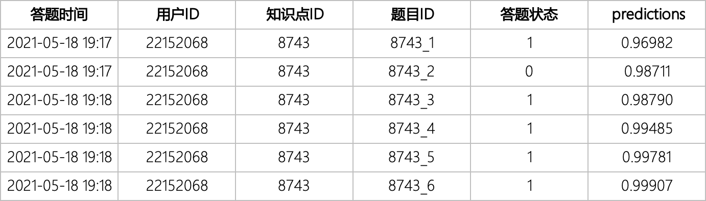
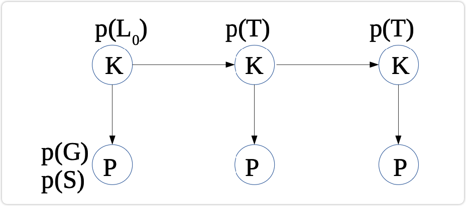
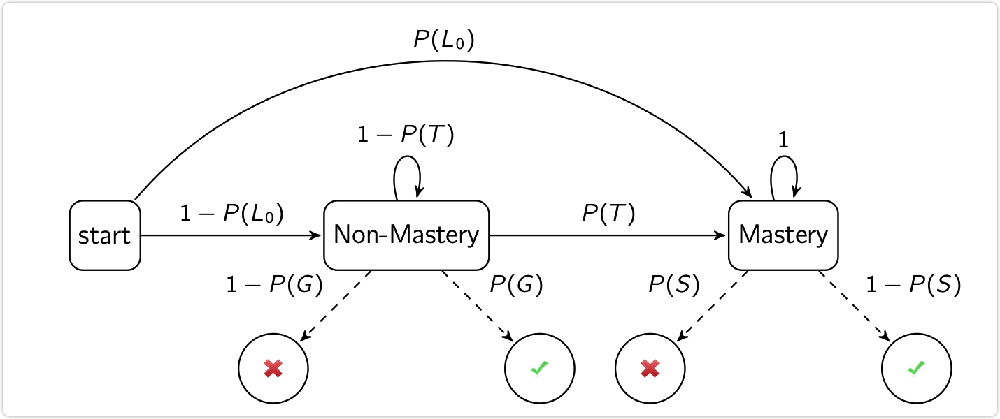
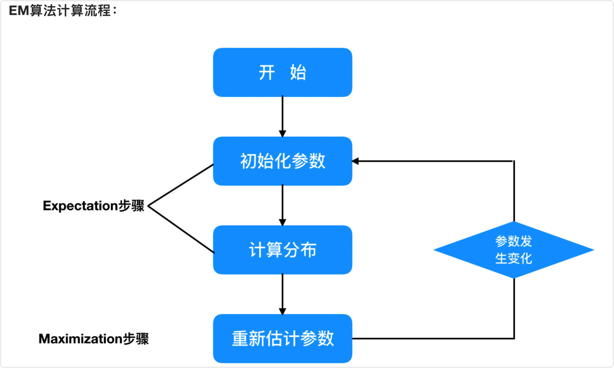
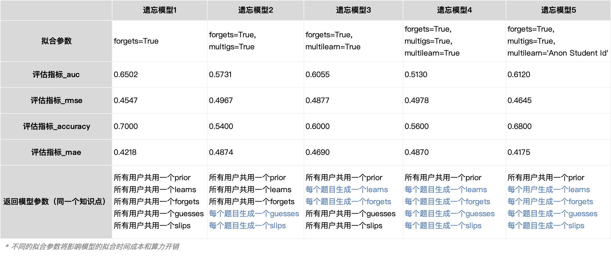

*GitHub中md文档对数学公式不适配，强烈建议将文档下载到本地通过专业的md软件打开，推荐使用Typora*

<br>

<br>

<br>

# 贝叶斯知识点追踪模型

## BKT模型业务应用待解决问题

| 待解决问题                                                   | 解决方案                                                     | 状态                                                         |
| ------------------------------------------------------------ | ------------------------------------------------------------ | ------------------------------------------------------------ |
| BKT模型最终是根据贝叶斯公式在不同$obs_t$下的后验概率值，并未对知识点掌握与否给出直接的结果，而实际业务最终需要的是学生在某个末级知识点是否掌握。 | 根据知识点下不同题目的作答成绩、求解后验概率有没有满足seed(默认≥0.85)的条件，然后返回用户ID，末级知识点ID，末级知识点掌握状态分类（0 \| 1），掌握值 | <span style="white-space:nowrap;">[已解决](#ng_state)&emsp;&emsp;</span> |
| BKT模型是根据历史答题数据拟合出学习参数和表现参数，但如果末级知识点在拟合时所有的学生都为学过、则不会得出相关参数、也就意味着模型对未来新学习数据鲁棒性极差。 | 在对知识点预测时，若知识点在模型拟合得到的参数中不存在：<br>1、返回不预测的结果<br/>2、对新知识点进行拟合，并进行预测，但这种状况下因为新知识点观测值较少、结果不一定理想。 | 待解决                                                       |
| 现实业务中V3版本42讲之后的实际答题数据有5000W+的数据量，模型在首次拟合时将极大地耗费算力和时间。 | 1、目前已拟合21年3月的答题数据，AUC0.61，还需要把剩余的数据进行拟合。<br> | 待解决                                                       |

<br>

<br>

<br>

## 模型目标任务

如下图，22152068用户在8743的知识点上经过对6道题目的作答，在答完最后一题时模型预测用户对该知识点的掌握情况为99.907%，因此可以判断出用户在这个知识点下已经**掌握**该知识点。



从表格数据来看，有两大问题需要解决：

1.  用户答第一道题目8743_1时预测的掌握概率(学会概率)=0.96982是[如何计算](#number1)的？
2.  用户答最后一道题目8743_6时预测的掌握概率(学会概率)=0.99907又是如何计算的？

<br>

<br>

<br>

## 模型工作原理



*K=知识节点(0或1)，Q=表现节点(0或1)*

| 学习参数     | 初始概率P(L0) = Intirial Knowledge，表示学生的未开始做这道题目时或开始连续这项知识点的时候，掌握概率 |
| ------------ | ------------------------------------------------------------ |
| **学习参数** | **学习概率P(T) = Probability of learning，表示学生经过做题练习后，知识点从不会到学会的概率** |
| **表现参数** | **猜测概率P(G) = Probability of guess，表示学生没掌握这项知识点，但是还是蒙对的概率** |
| **表现参数** | **失误概率P(S) = Probability of slip，表示学生实际上掌握了这项知识点，但是还是给做错了的概率** |
| **遗忘参数** | **遗忘概率P(F) = Probability of forgets，表示学生对这项知识点，从会做到遗忘的概率** |

<br>



>   知识追踪模型由Atkinson于1972年首次提出。它假设每个知识点由猜测率、学习率、失误率和学习知识之前的先验概率4个参数组成，并由Corbett和Anderson引入智能教育领域，目前该模型已经发展成为智能辅导系统中对学习者知识掌握情况建模的主流方法。
>
>   知识追踪模型针对不同的知识点分别进行建模，因此，学生对知识点的掌握情况一般是把将要学习的知识体系分为以层级关系连接的若干个知识点，并把学生对每个知识点的掌握水平用一组二元变量来表示，每组二元变量代表学习者对此知识点处于“会”和“不会”两种状态之一。
>
>   模型的每个知识点赋予5个参数，分别为两个学习参数初始先验概率P(L)和学习概率P(T)、两个表现参数猜测概率P(G)和失误概率P(S)、一个遗忘参数P(F)。遗忘参数在Corbett和Anderson首次提出的知识追踪模型中遗忘概率P(F)设置为0，即假设学习者在知识学习过程中不存在遗忘。
>
>   知识追踪模型是一种特殊的隐马尔科夫模型（HMM），每一个节点都是一个含有[隐变量的马尔可夫](#hmm)过程，自身含有知识点掌握和不掌握的隐藏状态。通过当下答题的表现状态，重新计算掌握概率值并传递给下一个答题表现。也就是给**定观测序列（答题状态序列）集使其产生一个隐马尔科夫模型，并不断的根据答题数据来调整模型参数使得该观测序列出现的概率最大**。

<br>

<br>

<br>

### 隐马尔可夫模型

>   隐马尔可夫模型是关于时序的概率模型，描述由一个隐藏的马尔可夫链随机生成不可观测的状态随机序列，再由各个状态生成一个观测而产生观测随机序列的过程。
>
>   隐藏的马尔可夫链随机生成的状态的序列，称为状态序列；每个状态生成一个观测，而由此产生的观测的随机序列，称为观测序列。序列的每一个位置又可以看作是一个时刻。

隐马尔可夫模型的形式定义如下：

-   设Q是所有可能的状态的集合，V是所有可能的观测的集合(N是可能的状态数，M是可能的观测数)。

    $ Q=\{q_1,q_2,...,q_N\}, V=\{v_1,v_2,...,v_M\big\}$

-   I是长度为T的状态序列，O是对应的观测序列。

    $ I=\{i_1,i_2,...,i_T\}, O=\{o_1,o_2,...,o_T\big\}$

-   A是状态转移概率矩阵

    $ A=[a_{ij}]_{N×N}$，其中$[a_{ij}]=p(i_{t+1}=q_j|i_t=q_i)$，$i=1,2,...,N;j=1,2,...,N$是在时刻t处于状态$q_i$的条件下在时刻$t+1$转移到状态$q_j$的概率。

-   B是观测概率矩阵

    $B=[b_j(k)]_{N×M}$，其中$b_j(k) = P(o_t=v_k|i_t=q_j)$，$k=1,2,...,M;j=1,2,...,N$是在时刻t处于状态$q_j$的条件下生成观测$v_k$的概率。

-   $\pi$是初始状态概率向量

    $\pi = (\pi_i)$，其中$\pi_i=P(i_1=q_i)$，$i=1,2,...,N$是时刻t=1处于状态$q_i$的概率

隐马尔可夫模型由**初始状态概率向量π**、**状态转移概率矩阵A**以及**观测概率矩阵B**决定。π和A决定隐藏状态序列，B决定观测序列。因此，知识追踪模型使用的隐马尔可夫模型λ可以用三元符号表示λ**=[A, B,π]**，三元符号称为隐马尔可夫模型的三要素。

**矩阵A**与**向量π**确定了隐藏的[马尔可夫链](#MarkovChain)，生成不可观测的状态序列。**矩阵B**确定了如何从状态序列中生成可观测并与状态序列综合确定了如何产生可观测的序列。

最终实现的是在**给定观测序列集使其产生一个隐马尔可夫模型，并不断的根据观测序列（答题数据）来学习并调整模型参数使得该观测序列出现的概率最大（也就是调整模型参数 λ=[A, B,π], 使得P(O|λ)最大）**，学习并调整模型参数过程可以通过最大期望算法（EM算法）来实现。



>   最大期望算法（EM算法），是在概率模型中寻找参数[极大似然估计](#jidasiranguji)或者最大后验估计的算法，其中概率模型依赖于无法观测的隐性变量。最大期望算法经过两个步骤交替进行计算：
>
>   **第一步**是E步求期望（expectation，求期望过程则使用Baum-Welch算法），利用对隐藏变量的现有估计值，计算其最大似然估计值； 
>
>   **第二步**是M步求极大（maxmization），最大化在E步上求得的最大似然值来计算参数的值。M步上找到的参数估计值被用于下一个E步计算中，这个过程不断交替进行。
>
>   [极大似然估计](#jidasiranguji)中心思想就是：知道结果，反推条件参数λ。

<br>

<br>

<br>

## 模型实际计算

### <span id='number1'>第一道题目掌握概率0.96982是如何计算的？</span>


>   *S：隐变量，表示的是状态* 
>
>   *O：观测变量，表示的是看到的值，用K表示*
>
>   *A：状态的转移矩阵，也就是S1到S2的矩阵概率*
>
>   *B：观测变量概率矩阵，也就是S1观测到K出现时的概率体现*
>
>   *A和B都是参数，需要经过不断的学习求优*

根据上图中HMM的图模型和实际业务模型的映射，结合业务数据：

1.  答题的观测序列  $K = O=\{1,0,1,1,1,1\}=\{对,错,对,对,对,对\}，T=6$ 

2.  根据知识追踪模型5个参数，依经验设定：

    先验概率P(L) = 0.896998749884554 ≈ 0.897

    学习概率P(T) = 0.326489899490336 ≈ 0.327

    猜测概率P(G) = 0.109629498816679 ≈ 0.110

    失误概率P(S) = 0.129511255098936 ≈ 0.130

    遗忘参数P(F) = 0

3.  根据隐马尔可夫模型定义，依学习参数和表现参数设定：

    $π =(0.897,0.103)=(P(L),1-P(L))$

    $A =
    \left[
        \begin{matrix}
            0.673 & 0\\
            0.327 & 1\\
        \end{matrix}
    \right] = 
    \left[
        \begin{matrix}
            1-P(T) & 0\\
            P(T) & 1\\
        \end{matrix}
    \right]
    $

    $B =
    \left[
        \begin{matrix}
            0.890 & 0.110\\
            0.130 & 0.870\\
        \end{matrix}
    \right] = 
    \left[
        \begin{matrix}
            1-P(G) & P(G)\\
            P(S) & 1-P(S)\\
        \end{matrix}
    \right]
    $

4.  特别需要注意的：

    *   转移矩阵$A$转移的概率之和为1，其表现形式 $\sum\limits_{j=1}^Na_{ij}=1$，也就t-1时刻$i$状态转移到t时刻$j$状态有N中可能，所以转移的概率之和为1，转移矩阵$A$有时也会被表示为$P(q_t|q_{t-1})$，其中$q_t=t时刻状态，q_{t-1}=t-1时刻状态$。
    *   观测概率矩阵(又称发射矩阵)$B$转移的概率之和为1，其表现形式$\sum\limits_{j=1}^Kb_{ij}=1$，也就是观测值有M种可能，所以转移的概率之和为1，转移矩阵$B$有时也会被表示为$P(o_t|q_t)$。

根据[马尔可夫假设](#hypothesis)在隐马尔可夫（EM算法）单次迭代的过程中，隐藏状态转移概率矩阵A和隐藏观测概率矩阵矩阵B是保持不变的。

将观测序列数据看作观测变量$O$ ，状态序列数据看作不可观测的隐变量$I$，则隐马尔可夫模型**λ=[A, B,π]**事实上是一个含有隐变量的概率、表示为：$P(O|λ)=\sum\limits_{I}P(O|I,λ)P(I|λ)$，求和下的标识$I$是观测序列值中某一个隐状态概率的集合之和，其参数学习通过EM算法实现。

#### **1)  E步，求期望Q(λ,λ̂)**

$Q(\lambda,\overline{\lambda})=\sum\limits_{I}logP(I,O|λ)P(I,O|\overline{\lambda})$

在Q函数中，已知的参数$\overline{\lambda}=[\pi,A,B]$，所以$P(I,O|\overline{\lambda})$是一个确定的联合概率值。那么$Q(\lambda,\overline{\lambda})$相当于是一个期望$E[logP(I,O|\lambda)]$，所以首先需要做的是计算$logP(I,O|\lambda)$，也就是隐变量$I$和观测值$O$的联合概率是多少。

***代入数据实际求解过程可参见Excel文件《BKT推导过程 》***

| 数学推导公式                                                 | 代入数据实际求解                                             |
| ------------------------------------------------------------ | ------------------------------------------------------------ |
| 某一条路径联合概率之和的对数=$logP(I,O|\lambda)$<br>$=log \pi_{i_1} + \sum\limits_{t=1}^{T-1}loga_{i_ti_{t+1}}+ \sum\limits_{t=1}^{T}logb_{i_t}(O_t)$<br>$=log\pi_{i_1} * logb_{i_1}(O_1) * loga_{i_1i_2}b_{i_2}(O_2) * loga_{i_2i_3}b_{i_3}(O_3) * \cdots$ | $O_1$=(0.01425540,0.98574460)<br>$O_2$=(0.06248217,0.93751783)<br>$O_3$=(0.00550225,0.99449775)<br>$O_4$=(0.00046823,0.99953177)<br>$O_5$=(0.00003973,0.99996027)<br>$O_6$=(0.00000337,0.99999663)<br><br/>过程略，因为实际计算$t+1$时刻依赖于$t$时刻的计算结果再进行计算、太过冗长且复杂，详见Excel文件"EM for 1"Step2-Step7 |
| 根据$P(O,I|\lambda) = π_{i_1}b_{i_1}(O_1)a_{i_1i_2}b_{i_2}(O_2) a_{i_2i_3}b_{i_3}(O_3) \cdots\ a_{i_{T-1}i_T}b_{i_T}(O_T)$得到：$\\ Q(\lambda,\overline{\lambda})=\\ \sum\limits_{I}logP\pi_{i_1}P(I,O|\overline{\lambda}) \\ + \sum\limits_{I}\sum\limits_{t=1}^{T-1}loga_{i_ti_{t+1}}P(I,O|\overline{\lambda}) \\+\sum\limits_{I}\sum\limits_{t=1}^{T}logb_{i_t}(O_t)P(I,O|\overline{\lambda})$ | 经过递推得到新的：<br>$A^{(t+1)}=\left[  \begin{matrix}0.025 & 0.000 \\ 0.028 & 4.947    \end{matrix}\right]$<br>$B^{(t+1)}=\left[  \begin{matrix}0.023 & 0.977 \\ 0.030 & 4.970\end{matrix}\right]$<br>$\pi^{(t+1)}=(0.028,0.972)$<br><br/>过程略，因为$t-1$时刻的求和依赖于$t$时刻的计算结果再进行计算、太过冗长且复杂，详见Excel文件"EM for 1"Step8-Step18 |

<br>

#### **2)  M步，极大化Q(λ,λ̂)求模型参数A, B,π**

由于要极大化的参数在上式中单独地出现在3个项中，所以只需要对各项分别极大化。

| 数学推导公式                                                 | 代入数据实际求解                                             |
| ------------------------------------------------------------ | ------------------------------------------------------------ |
| 极大化$\sum\limits_{I}logP\pi_{i_1}P(I,O|\overline{\lambda})$，求解中需要$\pi_i$满足约束条件$\sum\limits_{i=1}^{T}\pi_{i}=1$ | $\pi_{i}=\frac{\pi^{(t+1)}}{\sum\pi^{(t+1)}}=(\frac{0.028}{1},\frac{0.972}{1})=(0.278,0.972)$ |
| 极大化$\sum\limits_{I}\sum\limits_{t=1}^{T-1}loga_{i_ti_{t+1}}P(I,O|\overline{\lambda})$，求解中需要$a_{ij}$满足约束条件$\sum\limits_{j=1}^Na_{ij}=1$ | $a_{ij}=\frac{\left[  \begin{matrix}a^{(t+1)_0},a^{(t+1)_1}\end{matrix}\right]}{\left[  \begin{matrix}\sum a^{(t+1)_0},\sum a^{(t+1)_1}\end{matrix}\right]}=\left[  \begin{matrix}\frac{0.025}{0.053} & \frac{0.000}{4.947} \\ \frac{0.028}{0.053} & \frac{4.947}{4.947}    \end{matrix}\right]=\left[  \begin{matrix}0.477 & 0.000 \\ 0.523 & 1.000    \end{matrix}\right]$ |
| 极大化$\sum\limits_{I}\sum\limits_{t=1}^{T}logb_{i_t}(O_t)P(I,O|\overline{\lambda})$，求解中需要$b_{ij}$满足约束条件$\sum\limits_{j=1}^Kb_{ij}=1$ | $b_{ij}=\frac{\left[  \begin{matrix}b^{(t+1)_0},b^{(t+1)_1}\end{matrix}\right]}{\left[  \begin{matrix}\sum b^{(t+1)_0},\sum b^{(t+1)_1}\end{matrix}\right]}=\left[  \begin{matrix}\frac{0.023}{0.053} & \frac{0.977}{5.947} \\ \frac{0.030}{0.053} & \frac{4.970}{5.947}    \end{matrix}\right]=\left[  \begin{matrix}0.437 & 0.164 \\ 0.563 & 0.836    \end{matrix}\right]$ |

<br>

#### **3)  求解计算P(O|λ)模型参数**

| 模型参数                        | 第一次迭代  | 第二次迭代                               | 第三次迭代                                |
| :------------------------------ | :---------- | :--------------------------------------- | :---------------------------------------- |
| 初始先验概率$P(L_0=\pi_{i_1})$  | 0.972       | 0.972                                    | 0.970                                     |
| 初始学习概率$P(T=a_{ij_{1,0}})$ | 0.523       | 0.507                                    | 0.489                                     |
| 初始遗忘概率$P(F=a_{ij_{0,1}})$ | 0.000       | 0.000                                    | 0.000                                     |
| 初始猜测概率$P(G=b_{ij_{1,0}})$ | 0.563       | 0.668                                    | 0.693                                     |
| 初始失误概率$P(S=b_{ij_{0,1}})$ | 0.164       | 0.165                                    | 0.165                                     |
| $\overline{\lambda}$收敛值      | -2.82798008 | 0.11486504=<br>(2.70311504)-(2.82798008) | 0.00175005=<br/>(2.70136499)-(2.70311504) |

<br>

#### **4)  收敛性计算**

第一道题目掌握概率0.96982≈0.970≠0.972，显然EM只进行了一次迭代，参数$\overline{\lambda}$还未收敛导致，也就是说得到的隐马尔可夫模型参数预测的结果与实际的观测值偏差较大。

因此需要根据M步得到的结果$[A,B,\pi]$作为下一次迭代的初始概率进行迭代，直至$\overline{\lambda}$收敛，停止计算返回HMM参数。

那么，怎么才能证明$\overline{\lambda}$收敛了？考虑到参数迭代计算的性能和实效性、设定下一次迭代$\overline{\lambda}$收敛值－本次迭代$\overline{\lambda}$收敛值<0.001则停止迭代，因为下一次迭代参数预测结果与此次迭代参数预测结果高度相似。

$\overline{\lambda}$收敛值计算公式：$\sum\limits_{t=1}^{T}logP(I,O|\lambda)$

<br>

<br>

<br>

### **最后一道题目掌握概率0.99907又是如何计算的？**

EM算法的不断迭代，在第三次迭代中模型已经收敛，得到的HMM模型参数为：

*   $P(L_0)≈0.970≈0.96982146$
*   $P(T)≈0.489≈0.48845366$
*   $P(G)≈0.693≈0.69324773$
*   $P(T)≈0.165≈0.16522272$

<br>


如上图，BKT模型在根据初始概率下，根据每道题的答题结果（正确或错误），更新下一题答题时的$P(L)$，计算公式如下：
$$
P(L_t|obs_t = 1) = \frac{P(L_t)(1-P(S))}{P(L_t)(1-P(S))  +  (1-P(L_t))P(G)}
$$

$$
P(L_t|obs_t = 0) = \frac{P(L_t)P(S)}{P(L_t)P(S)  +  (1-P(L_t))(1-P(G))}
$$

$$
P(L_{t+1}) = P(L_t|obs_t) + (1-P(L_t|obs_t))P(T)
$$

| 答题时间          | 用户ID   | 知识点ID | 题目ID | 答题状态 | predictions | 更新下一题答题时的P(L) |
| ----------------- | -------- | -------- | ------ | -------- | ----------- | ---------------------- |
| 2021-05-18  19:17 | 22152068 | 8743     | 8743_1 | 1        | 0.96982     | 0.97481                |
| 2021-05-18  19:17 | 22152068 | 8743     | 8743_2 | 0        | 0.98711     | 0.97634                |
| 2021-05-18  19:18 | 22152068 | 8743     | 8743_3 | 1        | 0.98790     | 0.98993                |
| 2021-05-18  19:18 | 22152068 | 8743     | 8743_4 | 1        | 0.99485     | 0.99572                |
| 2021-05-18  19:18 | 22152068 | 8743     | 8743_5 | 1        | 0.99781     | 0.99818                |
| 2021-05-18  19:18 | 22152068 | 8743     | 8743_6 | 1        | 0.99907     | 0.99923                |


>   HMM公式推导过程参考如下：
>
>   [隐马尔可夫模型之Baum-Welch算法详解](https://blog.csdn.net/u014688145/article/details/53046765)
>
>   [HMM无监督学习](http://www.huaxiaozhuan.com/统计学习/chapters/15_HMM.html)
>
>   [HMM参数学习-EM算法](http://www.huaxiaozhuan.com/统计学习/chapters/13_EM.html)
>
>   [pyBKT: An Accessible Python Library of Bayesian Knowledge Tracing Models](https://arxiv.org/abs/2105.00385)

<br>

<br>

<br>

## 代码实现

### Step1构建模型

```python
import pyBKT
model = Model(num_fits=1)
```

<br>

### Step2 拟合模型

```Python
model.fit(data=ct_df)
```

>   BKT模型fit拟合过程已经实现了代码的改造，体现在：
>
>   *   E步过程的单一进程改造（为了方便观察E步过程的日志打印，改为了单线程计算）
>   *   拟合全过程的每一步骤的log打印
>
>   
>
>   因此，如果需要查看每一步骤的log打印则需要在构建模型时传参print=True
>
>   如果需要观察E步过程则需要在构建模型时传参print=True, parallel=False

<br>

**拟合过程概况分析**

1.  根据HMM模型的要求，生成初始化参数 λ=[A, B,π]

    ```python
    {'prior': 0.4457060630095818, 
     'learns': array([0.08152828]), 
     'forgets': array([0.]), 
     'guesses': array([0.25530859]), 
     'slips': array([0.04539381]), 
     'A': array([[[1.        , 0.        ],[0.08152828, 0.91847172]]]), 
     'B': array([[[0.97444928, 0.02555072],[0.01894198, 0.98105802]]]), 
     'π': array([[9.99578341e-01],[4.21659067e-04]])
    }
    ```

2.   E步，求期望Q(λ,λ̂)

     ```Python
     import numpy as np
     
     dot, sum, log = np.dot, np.sum, np.log
     def e(x):
         As, Bn, initial_distn = x['A'], x['B'], x['π'],
         lengths, num_resources = x['lengths'], x['num_resources']
         num_subparts, alldata, normalizeLengths = x['num_subparts'], x['alldata'], x['normalizeLengths']
         alpha_out, sequence_idx_start, sequence_idx_end = x['alpha_out'], x['sequence_idx_start'], x['sequence_idx_end']
     
         N_R, N_S = 2 * num_resources, 2 * num_subparts
         trans_softcounts_temp = np.zeros((2, N_R))
         emission_softcounts_temp = np.zeros((2, N_S))
         init_softcounts_temp = np.zeros((2, 1))
         loglike = 0
     
         alphas = []
         for sequence_index in range(sequence_idx_start, sequence_idx_end):
             sequence_start = starts[sequence_index] - 1
             if prints: print(print_title('sequence_start'), sequence_start)
             T = lengths[sequence_index]
             if prints: print(print_title('T'), T)
             likelihoods = np.ones((2, T))
             if prints: print(print_title('create_likelihoods_array'), likelihoods)
             alpha = np.empty((2, T))
             if prints: print(print_title('create_alpha_array'), alpha)
             for t in range(min(2, T)):
                 for n in range(num_subparts):
                     data_temp = alldata[n][sequence_start + t]
                     if data_temp:
                         sl = Bn[:, 2 * n + int(data_temp == 2)]
                         likelihoods[:, t] *= np.where(sl == 0, 1, sl)
             alpha[:, 0] = initial_distn * likelihoods[:, 0]
             norm = sum(alpha[:, 0])
             alpha[:, 0] /= norm
             contribution = log(norm) / (T if normalizeLengths else 1)
             loglike += contribution
             if T >= 2:
                 resources_temp = allresources[sequence_start]
                 k = 2 * (resources_temp - 1)
                 alpha[:, 1] = dot(As[0:2, k: k + 2], alpha[:, 0]) * likelihoods[:, 1]
                 norm = sum(alpha[:, 1])
                 alpha[:, 1] /= norm
                 contribution = log(norm) / (T if normalizeLengths else 1)
                 loglike += contribution
     
             for t in range(2, T):
                 for n in range(num_subparts):
                     data_temp = alldata[n][sequence_start + t]
                     if data_temp:
                         sl = Bn[:, 2 * n + int(data_temp == 2)]
                         likelihoods[:, t] *= np.where(sl == 0, 1, sl)
                 resources_temp = allresources[sequence_start + t - 1]
                 k = 2 * (resources_temp - 1)
                 alpha[:, t] = dot(As[0:2, k: k + 2], alpha[:, t - 1]) * likelihoods[:, t]
                 norm = sum(alpha[:, t])
                 alpha[:, t] /= norm
                 loglike += log(norm) / (T if normalizeLengths else 1)
             gamma = np.empty((2, T))
             gamma[:, (T - 1)] = alpha[:, (T - 1)].copy()
             As_temp = As.copy()
             f = True
             for t in range(T - 2, -1, -1):
                 resources_temp = allresources[sequence_start + t]
                 k = 2 * (resources_temp - 1)
                 A = As_temp[0: 2, k: k + 2]
                 pair = A.copy()  # don't want to modify original A
                 pair[0] *= alpha[:, t]
                 pair[1] *= alpha[:, t]
                 dotted = dot(A, alpha[:, t])
                 gamma_t = gamma[:, (t + 1)]
                 pair[:, 0] = (pair[:, 0] * gamma_t) / dotted
                 pair[:, 1] = (pair[:, 1] * gamma_t) / dotted
                 np.nan_to_num(pair, copy=False)
                 trans_softcounts_temp[0: 2, k: k + 2] += pair
                 gamma[:, t] = sum(pair, axis=0)
                 for n in range(num_subparts):
                     data_temp = alldata[n][sequence_start + t]
                     if data_temp:
                         emission_softcounts_temp[:, (2 * n + int(data_temp == 2))] = emission_softcounts_temp[:,(2 * n + int(data_temp == 2))] + gamma[:, t]
                     if f:
                         data_temp_p = alldata[n][sequence_start + (T - 1)]
                         if data_temp_p:
                             emission_softcounts_temp[:, (2 * n + int(data_temp_p == 2))] += gamma[:, (T - 1)]
                 f = False
             init_softcounts_temp += gamma[:, 0].reshape((2, 1))
             alphas.append((sequence_start, T, alpha))
         return [trans_softcounts_temp, emission_softcounts_temp, init_softcounts_temp, loglike, alphas]
     
     
     
     out:
         {'收敛值': array([[-3.09863266]]), 'A': array([[[0.13174415, 0.1443327 ],
             [0.        , 4.72392315]]]), 'B': array([[[0.12052965, 0.87947035],
             [0.15556468, 4.84443532]]]), 'π': array([[0.14435019],
            [0.85564981]]), 'alpha': array([[7.85685622e-02, 9.21431438e-01, 2.77519789e-01, 7.22480211e-01,
             2.81365119e-02, 9.71863488e-01],
            [2.42679098e-03, 9.97573209e-01, 2.06139701e-04, 9.99793860e-01,
             1.74872987e-05, 9.99982513e-01]])}
     ```

3.   M步，极大化Q(λ,λ̂)求模型参数A, B,π

     ```Python
     # M步伪代码
     def m(model, A, B, π):
         z = np.sum(A, axis=1) == 0
         for i in range(len(z)):
             for j in range(len(z[0])):
                 if z[i, j]:
                     A[i, 0, j] = 0
                     A[i, 1, j] = 1
         B[np.sum(B, axis=2) == 0, :] = 1
         assert (A.shape[1] == 2)
         assert (A.shape[2] == 2)
         model['A'][:model['A'].shape[0]] = (A / np.sum(A, axis=1)[:model['A'].shape[0], None])
         model['learns'] = model['A'][:, 1, 0]
         model['forgets'] = model['A'][:, 0, 1]
         temp = np.sum(B, axis=2)
         model['B'] = B / temp[:, :, None]
         model['guesses'] = model['emissions'][:, 0, 1]
         model['slips'] = model['emissions'][:, 1, 0]
         model['π'] = π[:] / np.sum(π[:])
         model['prior'] = model['pi_0'][1][0]
         return model
     
     
     out:
         {'prior': 0.8556498089984058,
          'learns': array([0.52279901]),
          'forgets': array([0.]),
          'guesses': array([0.56344758]),
          'slips': array([0.15364864]),
          'A': array([[[0.47720099, 0.        ],[0.52279901, 1.        ]]]),
          'B': array([[[0.43655242, 0.56344758],[0.15364864, 0.84635136]]]),
          'π': array([[0.14435019],[0.85564981]])}
     ```

4.  迭代计算，直至模型收敛后得到模型参数A, B,π

<br>

###  Step3 效果评估

在业务实际应用中最终是需要知道知识点掌握与否，得到的是一个分类结果（0 | 1），但模型计算是根据知识点下$obs_t$计算不同时间下prior的后验概率，因此评估模型的表现状况只能根据原始的答题(正确=1 | 错误=0)与prior后验概率对比计算并对结果进行评估，评估指标：

```python
# 后验概率默认阈值为0.5的准确性评估
auc = .5682763103302735
rmse = .5087202856284727
accuracy = .4733548264744927
mae = 5036829422644872
```

```
auc：
	统计意义上auc≥0.8代表模型表现良好
	
rmse：
	均方根误差，表示预测值和实际观察值之间的差异的样本标准偏差，该指标说明了样本的离散程度，统计意义上值无限接近于0代表分类结果表现越好
	
accuracy：
	准确率（正确预测的样本数占总预测样本数的比值，它不考虑预测的样本是正例还是负例），作为参考评估项。
mae：
	平均绝对误差，表示预测值与观测值之间绝对误差的平均值，计意义上值无限接近于0代表分类结果表现越好
```

<br>

<br>

<br>

## 上线部署


<br>

<br>

<br>

## BKT遗忘模型

遗忘模型的拟合过程和标准模型相同，都是需要生成默认的伽马分布参数，在到EM算法(最大似然估计)中进行迭代，之后在每次迭代中计算收敛效果最好的参数返回给模型。

标准模型是假设用户在某个知识点下学习后不会存在遗忘的情况，然而该假设有违现实情况，因此推出BKT遗忘模型。遗忘模型的计算逻辑同标准模型类型，不相同的是在计算不同$obs_t$时间下答题的掌握概率是会加入forgets参数。

##### 遗忘模型1

```python
# 拟合模型
model.fit(data=ct_df, forgets=True)
## 拟合效果评估
print(model.evaluate(data=ct_df, metric=["auc", "rmse", "accuracy", mean_absolute_error]))
out:
    [0.6501623376623378, 0.4546819771358794, 0.7, 0.42175252609804015]

# 返回拟合后的模型参数
print(model.params())
out:
             知识点       参数     题目名称   value
0  Calculate unit rate    prior  default 0.99593
1  Calculate unit rate   learns  default 0.26663
2  Calculate unit rate  guesses  default 0.07648
3  Calculate unit rate    slips  default 0.06403
4  Calculate unit rate  forgets  default 0.32394
```

##### 遗忘模型2

```python
# 拟合模型
model.fit(data=ct_df, forgets=True, multigs=True)
## 拟合效果评估
print(model.evaluate(data=ct_df, metric=["auc", "rmse", "accuracy", mean_absolute_error]))
out:
    [0.573051948051948, 0.4967055058027041, 0.54, 0.4874383632631643]

# 返回拟合后的模型参数
print(model.params())
out:
             知识点       参数     题目名称   value
0   Calculate unit rate    prior     default 0.86605
1   Calculate unit rate   learns     default 0.14179
2   Calculate unit rate  guesses  RATIO2-001 0.35568
3   Calculate unit rate  guesses  RATIO2-003 0.22775
4   Calculate unit rate  guesses  RATIO2-012 0.39629
5   Calculate unit rate  guesses  RATIO2-022 0.04852
6   Calculate unit rate  guesses  RATIO2-029 0.50000
7   Calculate unit rate  guesses  RATIO2-054 0.19361
8   Calculate unit rate  guesses  RATIO2-061 0.03705
9   Calculate unit rate  guesses  RATIO2-062 0.34233
10  Calculate unit rate  guesses  RATIO2-071 0.15522
11  Calculate unit rate  guesses  RATIO2-078 0.50000
12  Calculate unit rate  guesses  RATIO2-099 0.16378
13  Calculate unit rate  guesses  RATIO2-106 0.04419
14  Calculate unit rate  guesses  RATIO2-109 0.50000
15  Calculate unit rate  guesses  RATIO2-127 0.09192
16  Calculate unit rate  guesses  RATIO2-130 0.34159
17  Calculate unit rate  guesses  RATIO2-131 0.23492
18  Calculate unit rate  guesses  RATIO2-140 0.50000
19  Calculate unit rate  guesses  RATIO2-144 0.50000
20  Calculate unit rate  guesses  RATIO2-149 0.50000
21  Calculate unit rate  guesses  RATIO2-156 0.11329
22  Calculate unit rate  guesses  RATIO2-177 0.50000
23  Calculate unit rate  guesses  RATIO2-180 0.07482
24  Calculate unit rate    slips  RATIO2-001 0.13395
25  Calculate unit rate    slips  RATIO2-003 0.52251
26  Calculate unit rate    slips  RATIO2-012 0.60497
27  Calculate unit rate    slips  RATIO2-022 0.50000
28  Calculate unit rate    slips  RATIO2-029 0.27647
29  Calculate unit rate    slips  RATIO2-054 0.36703
30  Calculate unit rate    slips  RATIO2-061 0.50000
31  Calculate unit rate    slips  RATIO2-062 0.49875
32  Calculate unit rate    slips  RATIO2-071 0.50000
33  Calculate unit rate    slips  RATIO2-078 0.47779
34  Calculate unit rate    slips  RATIO2-099 0.50000
35  Calculate unit rate    slips  RATIO2-106 0.50000
36  Calculate unit rate    slips  RATIO2-109 0.31250
37  Calculate unit rate    slips  RATIO2-127 0.50000
38  Calculate unit rate    slips  RATIO2-130 0.48364
39  Calculate unit rate    slips  RATIO2-131 0.50000
40  Calculate unit rate    slips  RATIO2-140 0.98728
41  Calculate unit rate    slips  RATIO2-144 0.56322
42  Calculate unit rate    slips  RATIO2-149 0.78023
43  Calculate unit rate    slips  RATIO2-156 0.50000
44  Calculate unit rate    slips  RATIO2-177 0.55189
45  Calculate unit rate    slips  RATIO2-180 0.50000
46  Calculate unit rate  forgets     default 0.27307
```

##### 遗忘模型3

```python
# 拟合模型
model.fit(data=ct_df, forgets=True, multilearn=True)
## 拟合效果评估
print(model.evaluate(data=ct_df, metric=["auc", "rmse", "accuracy", mean_absolute_error]))
out:
    [0.6055194805194806, 0.48765844772660205, 0.6, 0.4689732719268253]

# 返回拟合后的模型参数
print(model.params())
out:
             知识点       参数     题目名称   value
0   Calculate unit rate    prior     default 0.99322
1   Calculate unit rate   learns  RATIO2-001 0.77033
2   Calculate unit rate   learns  RATIO2-003 0.15760
3   Calculate unit rate   learns  RATIO2-012 0.95755
4   Calculate unit rate   learns  RATIO2-022 0.01247
5   Calculate unit rate   learns  RATIO2-029 0.86496
6   Calculate unit rate   learns  RATIO2-054 0.46550
7   Calculate unit rate   learns  RATIO2-061 0.35676
8   Calculate unit rate   learns  RATIO2-062 0.13004
9   Calculate unit rate   learns  RATIO2-071 0.26314
10  Calculate unit rate   learns  RATIO2-078 0.30777
11  Calculate unit rate   learns  RATIO2-099 0.09044
12  Calculate unit rate   learns  RATIO2-106 0.13084
13  Calculate unit rate   learns  RATIO2-109 0.76054
14  Calculate unit rate   learns  RATIO2-127 0.66004
15  Calculate unit rate   learns  RATIO2-130 0.28458
16  Calculate unit rate   learns  RATIO2-131 0.06178
17  Calculate unit rate   learns  RATIO2-140 0.43048
18  Calculate unit rate   learns  RATIO2-144 0.63391
19  Calculate unit rate   learns  RATIO2-149 0.26538
20  Calculate unit rate   learns  RATIO2-156 0.09018
21  Calculate unit rate   learns  RATIO2-177 0.04220
22  Calculate unit rate   learns  RATIO2-180 0.00466
23  Calculate unit rate  guesses     default 0.26861
24  Calculate unit rate    slips     default 0.32190
25  Calculate unit rate  forgets  RATIO2-001 0.11202
26  Calculate unit rate  forgets  RATIO2-003 0.27670
27  Calculate unit rate  forgets  RATIO2-012 0.40612
28  Calculate unit rate  forgets  RATIO2-022 0.44983
29  Calculate unit rate  forgets  RATIO2-029 0.15194
30  Calculate unit rate  forgets  RATIO2-054 0.38183
31  Calculate unit rate  forgets  RATIO2-061 0.33758
32  Calculate unit rate  forgets  RATIO2-062 0.24046
33  Calculate unit rate  forgets  RATIO2-071 0.91920
34  Calculate unit rate  forgets  RATIO2-078 0.03709
35  Calculate unit rate  forgets  RATIO2-099 0.98879
36  Calculate unit rate  forgets  RATIO2-106 0.54747
37  Calculate unit rate  forgets  RATIO2-109 0.04969
38  Calculate unit rate  forgets  RATIO2-127 0.96143
39  Calculate unit rate  forgets  RATIO2-130 0.18794
40  Calculate unit rate  forgets  RATIO2-131 0.60905
41  Calculate unit rate  forgets  RATIO2-140 0.08996
42  Calculate unit rate  forgets  RATIO2-144 0.65017
43  Calculate unit rate  forgets  RATIO2-149 0.79023
44  Calculate unit rate  forgets  RATIO2-156 0.62460
45  Calculate unit rate  forgets  RATIO2-177 0.15572
46  Calculate unit rate  forgets  RATIO2-180 0.98914
```

##### 遗忘模型4

```python
# 拟合模型
model.fit(data=ct_df, forgets=True, multigs=True, multilearn=True)
## 拟合效果评估
print(model.evaluate(data=ct_df, metric=["auc", "rmse", "accuracy", mean_absolute_error]))
out:
    [0.512987012987013, 0.4978063585954633, 0.56, 0.4870418360737846]

# 返回拟合后的模型参数
print(model.params())
out:
             知识点       参数     题目名称   value
0   Calculate unit rate    prior     default 0.99322
1   Calculate unit rate   learns  RATIO2-001 0.56733
2   Calculate unit rate   learns  RATIO2-003 0.50615
3   Calculate unit rate   learns  RATIO2-012 0.83132
4   Calculate unit rate   learns  RATIO2-022 0.04457
5   Calculate unit rate   learns  RATIO2-029 0.41400
6   Calculate unit rate   learns  RATIO2-054 0.96344
7   Calculate unit rate   learns  RATIO2-061 0.08963
8   Calculate unit rate   learns  RATIO2-062 0.25379
9   Calculate unit rate   learns  RATIO2-071 0.09654
10  Calculate unit rate   learns  RATIO2-078 0.73033
11  Calculate unit rate   learns  RATIO2-099 0.02123
12  Calculate unit rate   learns  RATIO2-106 0.03207
13  Calculate unit rate   learns  RATIO2-109 0.16777
14  Calculate unit rate   learns  RATIO2-127 0.12526
15  Calculate unit rate   learns  RATIO2-130 0.20930
16  Calculate unit rate   learns  RATIO2-131 0.12417
17  Calculate unit rate   learns  RATIO2-140 0.11986
18  Calculate unit rate   learns  RATIO2-144 0.05200
19  Calculate unit rate   learns  RATIO2-149 0.07593
20  Calculate unit rate   learns  RATIO2-156 0.18384
21  Calculate unit rate   learns  RATIO2-177 0.07777
22  Calculate unit rate   learns  RATIO2-180 0.03350
23  Calculate unit rate  guesses  RATIO2-001 0.00112
24  Calculate unit rate  guesses  RATIO2-003 0.14918
25  Calculate unit rate  guesses  RATIO2-012 0.16540
26  Calculate unit rate  guesses  RATIO2-022 0.04391
27  Calculate unit rate  guesses  RATIO2-029 0.50000
28  Calculate unit rate  guesses  RATIO2-054 0.02024
29  Calculate unit rate  guesses  RATIO2-061 0.08901
30  Calculate unit rate  guesses  RATIO2-062 0.17642
31  Calculate unit rate  guesses  RATIO2-071 0.09349
32  Calculate unit rate  guesses  RATIO2-078 0.50000
33  Calculate unit rate  guesses  RATIO2-099 0.02066
34  Calculate unit rate  guesses  RATIO2-106 0.03217
35  Calculate unit rate  guesses  RATIO2-109 0.50000
36  Calculate unit rate  guesses  RATIO2-127 0.15142
37  Calculate unit rate  guesses  RATIO2-130 0.49076
38  Calculate unit rate  guesses  RATIO2-131 0.12772
39  Calculate unit rate  guesses  RATIO2-140 0.50000
40  Calculate unit rate  guesses  RATIO2-144 0.50000
41  Calculate unit rate  guesses  RATIO2-149 0.50000
42  Calculate unit rate  guesses  RATIO2-156 0.18315
43  Calculate unit rate  guesses  RATIO2-177 0.50000
44  Calculate unit rate  guesses  RATIO2-180 0.03284
45  Calculate unit rate    slips  RATIO2-001 0.00012
46  Calculate unit rate    slips  RATIO2-003 0.18140
47  Calculate unit rate    slips  RATIO2-012 0.10885
48  Calculate unit rate    slips  RATIO2-022 0.50000
49  Calculate unit rate    slips  RATIO2-029 0.70165
50  Calculate unit rate    slips  RATIO2-054 0.02891
51  Calculate unit rate    slips  RATIO2-061 0.50000
52  Calculate unit rate    slips  RATIO2-062 0.69554
53  Calculate unit rate    slips  RATIO2-071 0.50000
54  Calculate unit rate    slips  RATIO2-078 0.07385
55  Calculate unit rate    slips  RATIO2-099 0.50000
56  Calculate unit rate    slips  RATIO2-106 0.50000
57  Calculate unit rate    slips  RATIO2-109 0.63046
58  Calculate unit rate    slips  RATIO2-127 0.50000
59  Calculate unit rate    slips  RATIO2-130 0.49272
60  Calculate unit rate    slips  RATIO2-131 0.50000
61  Calculate unit rate    slips  RATIO2-140 0.89847
62  Calculate unit rate    slips  RATIO2-144 0.83850
63  Calculate unit rate    slips  RATIO2-149 0.82739
64  Calculate unit rate    slips  RATIO2-156 0.50000
65  Calculate unit rate    slips  RATIO2-177 0.60260
66  Calculate unit rate    slips  RATIO2-180 0.50000
67  Calculate unit rate  forgets  RATIO2-001 0.99533
68  Calculate unit rate  forgets  RATIO2-003 0.58350
69  Calculate unit rate  forgets  RATIO2-012 0.83370
70  Calculate unit rate  forgets  RATIO2-022 0.96879
71  Calculate unit rate  forgets  RATIO2-029 0.90067
72  Calculate unit rate  forgets  RATIO2-054 0.78980
73  Calculate unit rate  forgets  RATIO2-061 0.93249
74  Calculate unit rate  forgets  RATIO2-062 0.81350
75  Calculate unit rate  forgets  RATIO2-071 0.93465
76  Calculate unit rate  forgets  RATIO2-078 0.11669
77  Calculate unit rate  forgets  RATIO2-099 0.99230
78  Calculate unit rate  forgets  RATIO2-106 0.96515
79  Calculate unit rate  forgets  RATIO2-109 0.09960
80  Calculate unit rate  forgets  RATIO2-127 0.12069
81  Calculate unit rate  forgets  RATIO2-130 0.18352
82  Calculate unit rate  forgets  RATIO2-131 0.78667
83  Calculate unit rate  forgets  RATIO2-140 0.98902
84  Calculate unit rate  forgets  RATIO2-144 0.66926
85  Calculate unit rate  forgets  RATIO2-149 0.75392
86  Calculate unit rate  forgets  RATIO2-156 0.85096
87  Calculate unit rate  forgets  RATIO2-177 0.52413
88  Calculate unit rate  forgets  RATIO2-180 0.99554
```

##### 遗忘模型5

```python
# 拟合模型 
model.fit(data=ct_df, forgets=True, multigs=True, multilearn='Anon Student Id')
## 拟合效果评估
print(model.evaluate(data=ct_df, metric=["auc", "rmse", "accuracy", mean_absolute_error]))
out:
    [0.612012987012987, 0.46453497987968884, 0.68, 0.4174941980036101]

# 返回拟合后的模型参数
print(model.params())
out:
             知识点       参数     题目名称   value
0   Calculate unit rate    prior     default 0.93692
1   Calculate unit rate   learns     3cjD21W 0.27710
2   Calculate unit rate   learns     4gJnw14 0.09922
3   Calculate unit rate   learns       745Yh 0.48110
4   Calculate unit rate  guesses  RATIO2-001 0.17818
5   Calculate unit rate  guesses  RATIO2-003 0.03876
6   Calculate unit rate  guesses  RATIO2-012 0.51791
7   Calculate unit rate  guesses  RATIO2-022 0.07810
8   Calculate unit rate  guesses  RATIO2-029 0.50000
9   Calculate unit rate  guesses  RATIO2-054 0.38312
10  Calculate unit rate  guesses  RATIO2-061 0.06490
11  Calculate unit rate  guesses  RATIO2-062 0.16550
12  Calculate unit rate  guesses  RATIO2-071 0.15846
13  Calculate unit rate  guesses  RATIO2-078 0.50000
14  Calculate unit rate  guesses  RATIO2-099 0.21216
15  Calculate unit rate  guesses  RATIO2-106 0.07523
16  Calculate unit rate  guesses  RATIO2-109 0.50000
17  Calculate unit rate  guesses  RATIO2-127 0.07419
18  Calculate unit rate  guesses  RATIO2-130 0.18945
19  Calculate unit rate  guesses  RATIO2-131 0.08795
20  Calculate unit rate  guesses  RATIO2-140 0.50000
21  Calculate unit rate  guesses  RATIO2-144 0.50000
22  Calculate unit rate  guesses  RATIO2-149 0.50000
23  Calculate unit rate  guesses  RATIO2-156 0.07812
24  Calculate unit rate  guesses  RATIO2-177 0.50000
25  Calculate unit rate  guesses  RATIO2-180 0.09300
26  Calculate unit rate    slips  RATIO2-001 0.06308
27  Calculate unit rate    slips  RATIO2-003 0.70977
28  Calculate unit rate    slips  RATIO2-012 0.53033
29  Calculate unit rate    slips  RATIO2-022 0.50000
30  Calculate unit rate    slips  RATIO2-029 0.15137
31  Calculate unit rate    slips  RATIO2-054 0.10773
32  Calculate unit rate    slips  RATIO2-061 0.50000
33  Calculate unit rate    slips  RATIO2-062 0.77267
34  Calculate unit rate    slips  RATIO2-071 0.50000
35  Calculate unit rate    slips  RATIO2-078 0.82410
36  Calculate unit rate    slips  RATIO2-099 0.50000
37  Calculate unit rate    slips  RATIO2-106 0.50000
38  Calculate unit rate    slips  RATIO2-109 0.18773
39  Calculate unit rate    slips  RATIO2-127 0.50000
40  Calculate unit rate    slips  RATIO2-130 0.83003
41  Calculate unit rate    slips  RATIO2-131 0.50000
42  Calculate unit rate    slips  RATIO2-140 0.99027
43  Calculate unit rate    slips  RATIO2-144 0.95168
44  Calculate unit rate    slips  RATIO2-149 0.83439
45  Calculate unit rate    slips  RATIO2-156 0.50000
46  Calculate unit rate    slips  RATIO2-177 0.83765
47  Calculate unit rate    slips  RATIO2-180 0.50000
48  Calculate unit rate  forgets     3cjD21W 0.81178
49  Calculate unit rate  forgets     4gJnw14 0.61816
50  Calculate unit rate  forgets       745Yh 0.22710
```

<br>

##### 5个遗忘模型对比



##### 遗忘模型的数据预测

```python
# 以标准模型为例
model.fit(data=ct_df, forgets=True, multigs=True)

# 返回拟合后的模型参数
print(model.params())
out:
           知识点       参数     题目名称   value
0  Calculate unit rate    prior  default 0.99867
1  Calculate unit rate   learns  default 0.28408
2  Calculate unit rate  guesses  default 0.03146
3  Calculate unit rate    slips  default 0.02190
4  Calculate unit rate  forgets  default 0.35487
```

